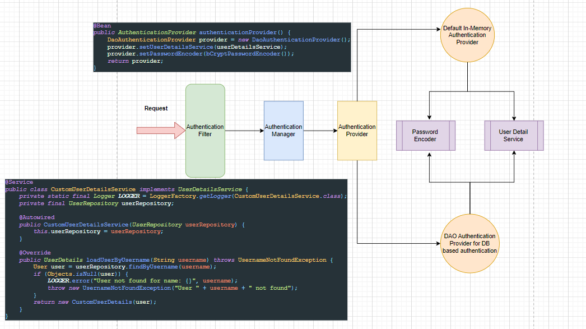

# Spring Security
- Intro to Security
- Custom Configuration
- CSRF (Cross-Site Request Forgery)
- User Registration and Login / Logout
- JWT (JSON Web Token)
- Implement JWT
- JWT for Microservices & App
- Login SSO (Single Sign-On)

********************************************************************

## How it works ?
- **sessionID** is generated on the login and stored in the browser
- with every new request the **sessionID** is validated
- when the logout button is clicked, the **sessionID** is invalidated and cleared from the browser cache

### Default Functionality
- username: user
- password: logged in the cmd
- default endpoint for logout: localhost:8080/logout

### How it works?
- **Dispatcher Servlet** (Front-Controller) : handles all the requests before sending them to the respective controllers
- **Filter Chain** : interceptors before the Dispatcher Servlet
	- one of those filter chain is security filter
	- it authenticates and authorizes that request

********************************************************************

## What is CSRF (Cross-Site Request Forgery)?
- **sessionID** stored in the browser cache, can be used by hackers or some malicious websites for making requests
- A **CSRF** token is also created along with the sessionID, which is stored as a hidden variable
- If this hidden variable is present in the header detail the request is allowed, else it given 401 Unauthorized
- If the GET request is made and spring-security is enabled the request is permitted
- If the request is GET, PUT or DELETE then the CSRF token is mandatory else 401 Unauthorized is returned
```
<input name="_csrf" type="hidden" value="Y6LU20AP-Wk20g0NQ_NSNEUFTyKPXc39yp8GLiuah2RbuboZVJXtv3Y9wV8bsGs_IN5mDXVnYkDpbf_Qq683GU-p4lI6j4l4" />
```

********************************************************************

## In order to override the auto-generate password we can configure username and password
```
# Overriding the default generated username and password
spring.security.user.name=utkarsh111
spring.security.user.password=iamawesome
```
********************************************************************
## Implementing Custom Authentication
- Request first goes through the `Authentication Filter`
- `Authentication Filter` talks to `Authentication Manager`which in turn talks to `Authentication Provider`
- By default, the `Authentication Provider` was talking to the In-Memory authentication provider
- If we would like to implement Database Authentication, then we will need `DAO Authentication Provider`
- Authentication Provider will talk to two things
  - `Password Encoder` : maintains the encoding
  - `UserDetailService` : has method `getByUsername()`
********************************************************************
### Enabling Web Security
- when we add `@EnableWebSecurity` in the config class, it imports all the required classes
  - `WebSecurityConfiguration.class`
  - `SpringWebMvcImportSelector.class`
  - etc.
- Below code snippet will authenticate all the requests, in the same manner it was by default
```
@Configuration
@EnableWebSecurity
public class WebSecurityConfig {
    @Bean
    public SecurityFilterChain securityFilterChain(HttpSecurity httpSecurity) throws Exception { //Providing own implementation bean for SecurityFilterChain
        httpSecurity
                .authorizeHttpRequests(
                        request -> request.anyRequest().authenticated()
                )
                .formLogin(Customizer.withDefaults())
                .httpBasic(Customizer.withDefaults())
                .csrf(AbstractHttpConfigurer::disable);
        return httpSecurity.build();
    }
}
```
********************************************************************

********************************************************************

### JWT (JSON Web Token)
- **Single Sign On** : sign in to different applications using same credentials
- JWT token contains three sections:
  - Header Section
  - Payload Data
  - Verify Signature
- Once the user logs-in a JWT token is generated and returned to the client-side
- Client-side then stored the JWT token, and then with each request the token is sent to the server
- For each request the token is verified, authenticated and authorized
********************************************************************